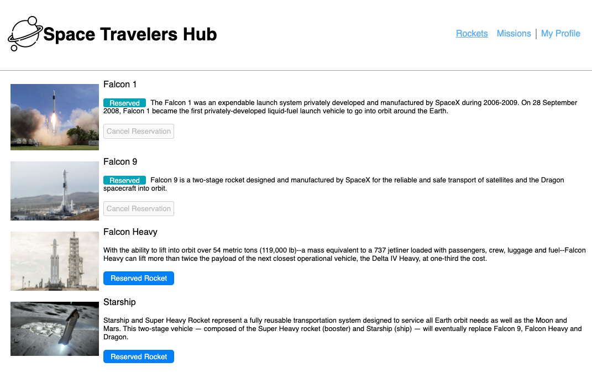

# Space Traveler Hub

> Build a page that shows missions and rockets feched from the SpaceX api and allows the user to reserve both missions and rockets.

<div align="center"></div>


Mobile ScreenShots

## Built With

- React.
- Redux.
- JavaScript.
- SpaceX api

 ## Live Demo

[Live Demo Link](https://eri8-9.github.io/react-app/#/home)

## Getting Started

## Video

[Link](https://www.loom.com/share/a451a571209c414b8663b7d8a2a812ba) to video on Loom.

### Prerequisites

  - Read about [React](https://reactjs.org/docs/getting-started.html) before start.
  - Just follow the steps for Getting started, Asset Managment(optional), Output Management and Development (Install the webpack-dev-server)

### Setup
  - Better have [VS Code](https://code.visualstudio.com/) installed or install the source-code editor of your preference. 

### Install

  - In the terminal go to the folder you going to work and write the next. 
  ```
  git clone https://github.com/eri8-9/Space-Travelers-Hub.git
  ```
  - Next go to VS Code editor and open the folder where you installed the repository.
### Usage

- Clone the repo.

- Run `npm install` on your terminal.

- Run `npm run build` on your terminal.

- Open the terminal in your machine and run `npm start` to start server.

## Authors

👤 **Christian Erick Contreras**

- GitHub: [@eri8-9](https://github.com/eri8-9)
- Linkedin: [LinkedIn](https:linkedin.com/in/christian-erick-contreras-9945b820b)
- Twitter: [@ChristianErick_](https://twitter.com/ChristianErick_)

👤 **Guilherme Giachellin**

- GitHub: [GuilhermeGiachellin](https://github.com/GuilhermeGiachellin)
- Linkedin: [LinkedIn](https://www.linkedin.com/in/guilherme-giachellin-2599771b9/)

## 🤝 Contributing

Contributions, issues, and feature requests are welcome!

Feel free to check the [issues page](https://github.com/eri8-9/Space-Travelers-Hub/issues).

## Show your support

Give a ⭐️ if you like this project!

## Acknowledgments

- Microverse

## 📝 License

This project is [MIT](LICENSE) licensed.
